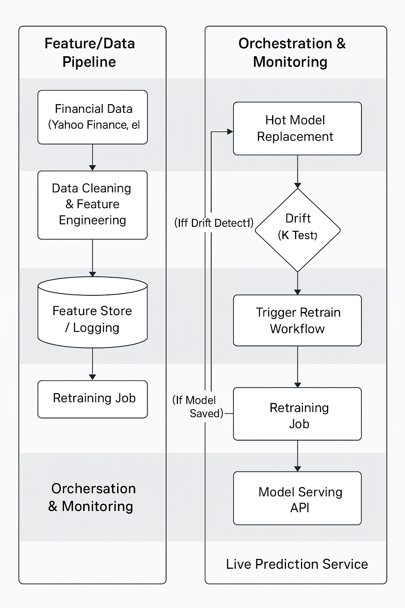

# Fair Value Prediction – Production ML System

A production-grade machine learning system for intrinsic stock value estimation, featuring drift detection,
automated retraining, hot model replacement, and cloud-based inference.

## Note on Source Code

The full implementation of this project is maintained in a private repository
due to deployment credentials and intellectual property constraints.

This public repository serves as a **system-design and production-workflow showcase**,
including architecture, automation logic, and execution proof.

## Business Problem

Retail investors often rely on multiple complex financial ratios (EPS, Book Value, Cash Flow, etc.)
to estimate intrinsic stock value, which increases decision complexity and risk.

This project simplifies the process by learning a **data-driven intrinsic value**
from multiple financial indicators, aligned with **value-investing principles**
to support lower-risk, long-term investment decisions.

## Solution Overview

The system continuously learns from financial data and automatically adapts
to changing data distributions using drift detection and retraining automation.

Key characteristics:
- Multi-factor intrinsic value modeling
- Automated drift detection (KS test)
- Automated retraining and deployment
- Hot model replacement
- Cloud-hosted inference API

  ## System Architecture

*High-level architecture showing data ingestion, drift detection, automated retraining, and deployment on Oracle Cloud VM.*

## Live Demo

🎥 Short demo showing live prediction via browser and automated ML workflow:

🎥 **Live Prediction Demo**
Shows real-time inference via browser using the deployed API:  
▶️ https://youtu.be/ZfAlvFwOjuI

🎥 **Automation & Workflow Demo**
Shows drift detection, automated retraining, and deployment via GitHub Actions:  
▶️ https://youtu.be/u9ojbXArhTM

The diagram below represents the actual production flow implemented in this system.

## Model Development & Validation

The intrinsic value model was developed using a rigorous, multi-stage modeling process:

- Financial data collection from Yahoo Finance (yfinance)
- Data cleaning and sanity checks on financial ratios
- Feature engineering using multiple fundamental indicators
- Log and power transformations to stabilize variance
- Baseline statistical modeling using OLS regression
- Multicollinearity checks using Variance Inflation Factor (VIF)
- K-Fold cross-validation for robustness
- Smearing factor correction to reduce bias from log-transformed targets
- Final model training using XGBoost with hyperparameter tuning
- Model interpretability using SHAP analysis

##flowchart LR
    A[Financial Data Yahoo Finance] --> B[Data Cleaning Sanity Checks]
    B --> C[Feature Engineering Fundamental Ratios]
    C --> D[Transformations Log / Power]
    D --> E[Statistical Validation OLS Regression]
    E --> F[Multicollinearity Check VIF]
    F --> G[K-Fold Cross Validation]
    G --> H[Bias Correction Smearing Factor]
    H --> I[XGBoost Training Hyperparameter Tuning]
    I --> J[Model Explainability SHAP Analysis]
    J --> K[Final Model Artifact]

## Deployment & Optimization

- Flask-based inference API for real-time prediction
- Gunicorn application server for production-grade concurrency
- Multi-stage Docker builds for optimized container size
- Docker image size reduced from ~2.7 GB to ~1.4 GB
- Faster container startup and reduced cloud resource usage
- Deployed on Oracle Cloud VM
- Hot model replacement via container restart without rebuild

  

